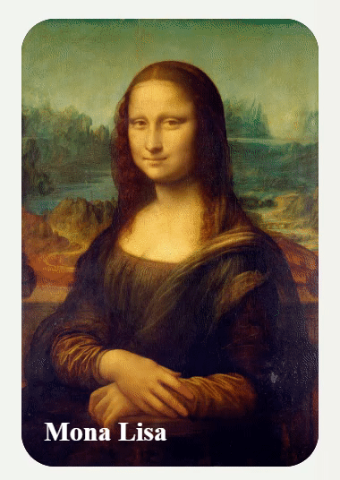

<h1>Card-monalisa</h1>
<h3>Descrição do projeto</h3>

É um cartão interativo com o tema da pintura Mona Lisa de Leonardo da Vinci. O cartão possui algumas informações como descrição da obra com um link para obter mais informações. Possui um menu lateral que aparece quando passamos a seta do mouse por cima. Nesse menu lateral existem ícones como localização, ticket e outras informações.

   
  

<h3>Funcionalidades:</h3>

É um cartão com funcionalidades de informar sobre autor e obra, compra de tickets e localização da obra. É um exemplo apenas de como podemos integrar as tecnologias CSS dentro de um projeto.

<h3>Tecnologias Utilizadas:</h3>

   
   
   

<h3>Conclusão:</h3>

É um projeto onde os itens e textos são construídos, editados e posicionados dentro de um cartão com animações e interações.

